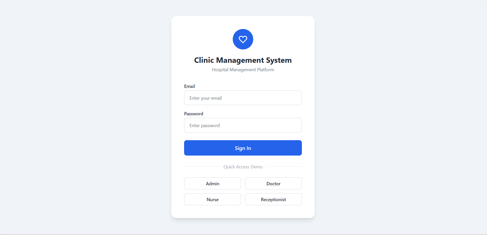
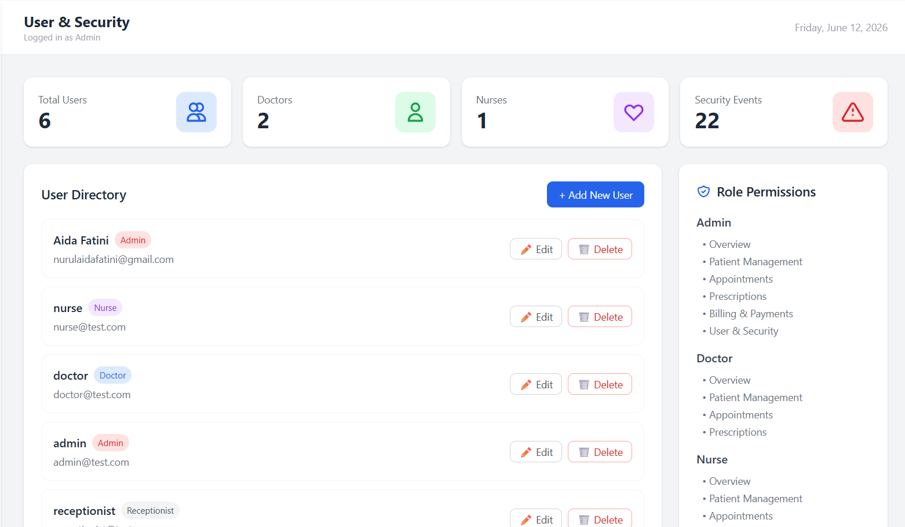
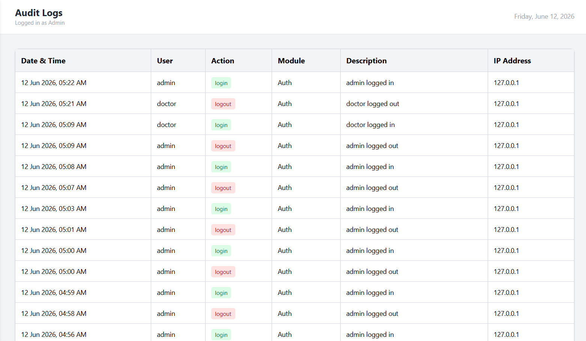
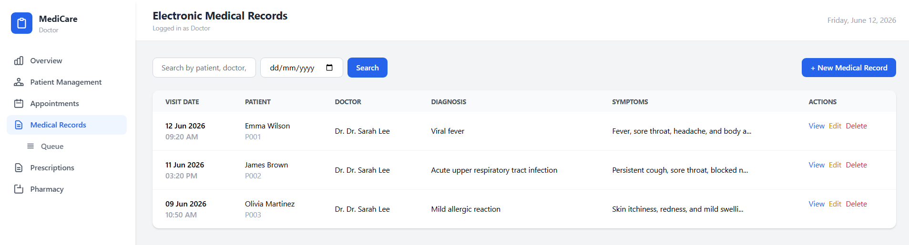
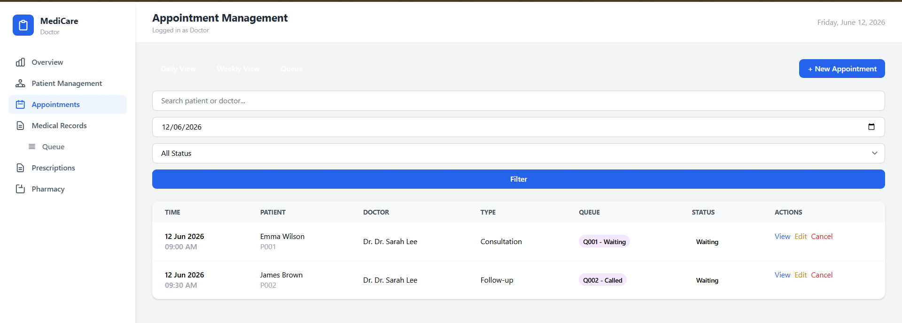
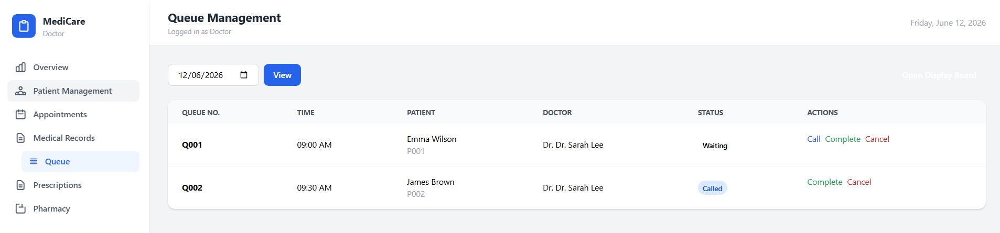

# Clinic Management System

**Group:** Aphrodite

**Course:** BIIT 2305 Web Application and Development - Section 02

**Submission Date:** 12th June 2026 (11.59 PM)

## 👨‍💻 Team Members
| Name                                     | Matric No | Role                            |
|------------------------------------------|-----------|---------------------------------|
| Putri Aimi Batrisyia Binti Muhammad Yusri|  2320206  | Dashboard, Billing & Integration|
| Niesa Batrisyia Binti Nor Hisham         | 2419714   | Appointment, Medical Records & Queue             |
| Nurin Sofina Binti Yusdi                 | 2221372   | Patient Management              |
| Nurul Aida Fatini Binti Mohd Rosli       | 2410416   | Authentication & Security       |
| Nur Adawiyah Binti Zakaria               | 2417438   |  Prescriptions & Medications    |

---

## 🚀 Project Description
The clinic management system is a web-based solution to improve the efficiency and organisation of daily healthcare operations. The system helps healthcare institutions manage patient records, appointments, prescriptions, medication inventory, and billing through a more centralised digital platform. It also provides role-based access for administrators, doctors, nurses, and receptionists to ensure secure and efficient system management. This web application adheres to Shariah principles such as transparency and justice by ensuring accurate medical data.

## Project's Features & Functionalities

### Dashboard Overview
* **Features:**
  * Displays total patients, today's appointments, and unpaid invoices.
  * Shows recent system activities and updates.
  * Provides a quick, real-time overview of clinic operations.
* **Usage:**
  * Users can view critical clinic statistics and recent activities immediately upon logging into the system.

### User Roles & Security *(Admin Only)*
* **Features:**
  * Complete user account lifecycle management (Create, Read, Update, Delete).
  * Role assignment for four distinct tiers: **Admin, Doctor, Nurse, and Receptionist**.
  * Strict Role-Based Access Control protecting internal clinic endpoints.
  * Automated audit logging tracking vital user activities.
* **Usage:**
  * System Administrators manage staff accounts and securely assign or revoke system permissions.
  * The application automatically restricts dashboard views according to each logged-in user's role.

### Patient Management
* **Features:**
  * Automated patient registration generating unique Patient IDs.
  * Centralized patient profile management.
  * Dynamic allergy tracking and automated safety alerts.
  * Instant access to a patient's historical medical records, previous consultation trails, and search filters.
* **Usage:**
  * Clinic staff register new patients and keep demographic information up to date.
  * Healthcare providers review historical data and critical allergy warnings before diagnostic treatment.

### Appointment & Scheduling
* **Features:**
  * Streamlined appointment booking, modification, and scheduling management.
  * Live doctor availability checking to avoid booking overlaps.
  * Dynamic daily and weekly clinic calendar views.
  * Real-time waiting room queue management system with appointment status tracking.
* **Usage:**
  * Receptionists schedule upcoming visits and walk-ins.
  * Front-desk staff manage active patient queues and monitor checkout progress fluidly.

### Prescriptions & Medication
* **Features:**
  * Medication inventory management.
  * Robust prescription creation tool linking multiple child drug items to a single consultation.
  * Comprehensive historical prescription logging and real-time status monitoring (*Active, Administered, Completed*).
* **Usage:**
  * Doctors quickly prescribe medications and outline flexible text-based durations (e.g., *"3 to 5 days"*).
  * Medical providers monitor and update medicine disbursement logs on the fly.

### Billing & Payments *(Admin & Receptionist Only)*
* **Features:**
  * Automated invoice generation combining consultation fees, clinic services, and items from the prescription engine.
  * Transaction recording with robust tracking mechanics.
  * Support for both partial payments and full checkout balances.
  * Ledger history management with automated real-time payment status updates.
* **Usage:**
  * Authorized staff instantly generate invoices immediately following a patient's consultation.
  * Payments are filed securely into the database while outstanding medical balances are monitored.

## Technologies Used
- **Framework:** Laravel 12
- **Language:** PHP 8.2
- **Database:** MySQL
- **Frontend:** Blade Templating
- **Build Tool:** Vite
- **Version Control:** Github

## Roles and Permissions
|        Module      | Admin | Doctor | Nurse | Receptionist |
|--------------------|-------|--------|-------|--------------|
| Dashboard          |  ✅  |   ✅   |   ✅ |       ✅     |
| Patient Management |  ✅  |   ✅   |   ✅ |       ✅     |
| Appointments       |  ✅  |   ✅   |   ✅ |       ✅     |
| Prescriptions      |  ✅  |   ✅   |   ✅ |       ❌     |
| Billing & Invoices |  ✅  |   ❌   |   ❌ |       ✅     |
| User Management    |  ✅  |   ❌   |   ❌ |       ❌     |

---

## Setup and Installation

## Requirements
- PHP >= 8.2
- Composer
- MySQL
- Node.js & NPM

### Steps

1. Clone the repository
```bash
   git clone 
   cd Aphrodite-Web-Clinic-Management-System
```

2. Install dependencies
```bash
   composer install
   npm install
```

3. Set up the environment
```bash
   cp .env.example .env
   php artisan key:generate
```
4. Configure database — open `.env` and set:
```
   DB_CONNECTION=mysql
   DB_HOST=127.0.0.1
   DB_PORT=3306
   DB_DATABASE=clinic_db
   DB_USERNAME=root
   DB_PASSWORD=
```
5. Run migrations and seeders
```bash
   php artisan migrate
   php artisan db:seed
```

6. Start the server
```bash
   php artisan serve
   npm run dev
```

7. Visit 'http://127.0.0.1:8000'

### Demo Login Credentials
| Role         | Email                    | Password    |
|--------------|--------------------------|-------------|
| Admin        | admin@test.com           | password123 |
| Doctor       | doctor@test.com          | password123 |
| Nurse        | nurse@test.com           | password123 |
| Receptionist | receptionist@test.com    | password123 |
---

## Screenshots

### Login & Registration


### User & Security


### Audit Logs


### Dashboard Overview
<!-- Add screenshot here --> 

### Patient Management


### Medical Records


### Appointment & Queue



### Billing & Payments


## ERD


## Sequence Diagram


## Learning Outcomes
### Technical Skills Gained
1. Laravel Framework: Understanding of MVC architecture and Eloquent ORM
2. Database Design: Creating efficient database schemas and relationships
3. Authentication: Implementing secure user authentication systems
4. Frontend Development: Building responsive interfaces with Bootstrap
5. Version Control: Using Git and GitHub for project management

### Soft Skills Developed
1. Team Collaboration: Every team member excellently does their part and actively responds
2. Project Management: Planning, dividing and executing a complex web application
3. Problem Solving: Debugging and resolving technical challenges
4. Documentation: Creating comprehensive project documentation

## Challenges Faced
1. Complex Clinic Management System
2. Variable Mismatches and Duplicates
3. Role-based Feature Confusion

## References
1. Laravel Documentation. (2024). Laravel 10.x Documentation. Retrieved from https://laravel.com/docs/10.x
2. Bootstrap Documentation. (2024). Bootstrap 5.3 Documentation. Retrieved from https://getbootstrap.com/docs/5.3/
3. MySQL Documentation. (2024). MySQL 8.0 Reference Manual. Retrieved from https://dev.mysql.com/doc/refman/8.0/en/
4. MDN Web Docs. (2024). Web Development Resources. Retrieved from https://developer.mozilla.org/
5. Stack Overflow. (2024). Programming Q&A Platform. Retrieved from https://stackoverflow.com/


  
<p align="center"><a href="https://laravel.com" target="_blank"></a></p>

<p align="center">
<a href="https://github.com/laravel/framework/actions"></a>
<a href="https://packagist.org/packages/laravel/framework"></a>
<a href="https://packagist.org/packages/laravel/framework"></a>
<a href="https://packagist.org/packages/laravel/framework"></a>
</p>

## About Laravel

Laravel is a web application framework with expressive, elegant syntax. We believe development must be an enjoyable and creative experience to be truly fulfilling. Laravel takes the pain out of development by easing common tasks used in many web projects, such as:

- [Simple, fast routing engine](https://laravel.com/docs/routing).
- [Powerful dependency injection container](https://laravel.com/docs/container).
- Multiple back-ends for [session](https://laravel.com/docs/session) and [cache](https://laravel.com/docs/cache) storage.
- Expressive, intuitive [database ORM](https://laravel.com/docs/eloquent).
- Database agnostic [schema migrations](https://laravel.com/docs/migrations).
- [Robust background job processing](https://laravel.com/docs/queues).
- [Real-time event broadcasting](https://laravel.com/docs/broadcasting).

Laravel is accessible, powerful, and provides tools required for large, robust applications.

## Learning Laravel

Laravel has the most extensive and thorough [documentation](https://laravel.com/docs) and video tutorial library of all modern web application frameworks, making it a breeze to get started with the framework. You can also check out [Laravel Learn](https://laravel.com/learn), where you will be guided through building a modern Laravel application.

If you don't feel like reading, [Laracasts](https://laracasts.com) can help. Laracasts contains thousands of video tutorials on a range of topics including Laravel, modern PHP, unit testing, and JavaScript. Boost your skills by digging into our comprehensive video library.

## Laravel Sponsors

We would like to extend our thanks to the following sponsors for funding Laravel development. If you are interested in becoming a sponsor, please visit the [Laravel Partners program](https://partners.laravel.com).

### Premium Partners

- **[Vehikl](https://vehikl.com)**
- **[Tighten Co.](https://tighten.co)**
- **[Kirschbaum Development Group](https://kirschbaumdevelopment.com)**
- **[64 Robots](https://64robots.com)**
- **[Curotec](https://www.curotec.com/services/technologies/laravel)**
- **[DevSquad](https://devsquad.com/hire-laravel-developers)**
- **[Redberry](https://redberry.international/laravel-development)**
- **[Active Logic](https://activelogic.com)**

## Contributing

Thank you for considering contributing to the Laravel framework! The contribution guide can be found in the [Laravel documentation](https://laravel.com/docs/contributions).

## Code of Conduct

In order to ensure that the Laravel community is welcoming to all, please review and abide by the [Code of Conduct](https://laravel.com/docs/contributions#code-of-conduct).

## Security Vulnerabilities

If you discover a security vulnerability within Laravel, please send an e-mail to Taylor Otwell via [taylor@laravel.com](mailto:taylor@laravel.com). All security vulnerabilities will be promptly addressed.

## License

The Laravel framework is open-sourced software licensed under the [MIT license](https://opensource.org/licenses/MIT).
